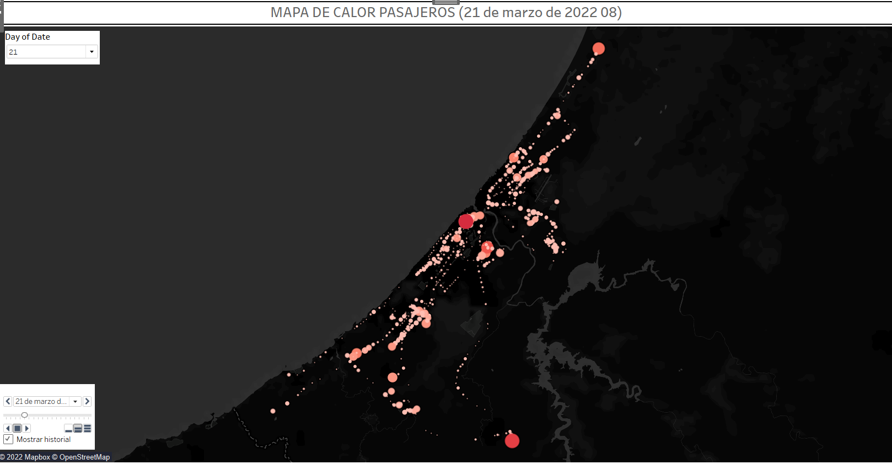

# Proyecto Optimización del Transporte
## Introducción:


El siguiente proyecto se trata de un caso real, para el cual me puse en contacto con el departamente de operaciones de una empresa operadora de transporte público por carretera, a la que ofrecí mis servicios de forma altruista.

Tras varias reuniones llegamos a un acuerdo en el que ellos me facilitaban datos de todas las lineas que operan en una ciudad y datos de pasajeros de una semana tipo, con el fin de sacar información y dashbords con Tableau que luego utilizarían para su explotación.  

Al tratarse de información confidencial no están disponibles para visualización ni los archivos csv, ni la base de datos, ni los dashbords de Tableau, sólo se pueden ver los archivos de python el los que se realiza la ETL.


## Fuentes de los datos:

 - BBDD de topología de la lineas de transporte
 - BBDD de las máquinas de venta de billetes
 

## Objetivos:

- Recopilar, explorar, limpiar y transformar los datos.
- Diseñar, crear y alimentar la base de datos en mySQL para uso propio.
- Analizar y crear dashbords en Tableau


## Entregables:

- `notebooks .ipynb` 
- `base de datos .sql`
- `dashboard tableau .twb`


## Recopilación de datos:

Para el proyecto me facilitan un esquema de la base de datos para que me familiarice con el tipo de datos que manejan, tras un estudio previo del la parte del negocio que me dejan ver, tengo una sesión con el responsable de data para que me vaya enviando los archivos que me le vaya solicitando.

Finalmente me pasan archivos .csv y .xlsx, tanto de la estructura red de tansporte (lineas, rutas, paradas con coordenadas geográficas), así como toda la venta de billetes a lo largo de una semana.  
        


## Exploración, limpieza y transformación:

Comienzo importando todos los csv y xlsx a un jupyter notebook y los guardo como dataframes de pandas para explorando los datos e ir comprendiendo cada uno de los campos.

Continuo limpiando y haciendo tranformaciones, con el fin de tener por un lado la estructura de la red de tranporte y la venta de billetes (muchos archivos de difentes formatos separados por billete o tarjeta por cada día de la semana)


## Diseño y creación de la base de datos:

Pese a que una vez transformados los datos y en formato .csv podría trabajar ya con ellos, decido crear una base de datos para leerla directamente desde Tableau simulando lo que ellos harán en un futuro.


Primero me diseño la estructura de la base de datos en un papel y cuando tengo claro cuales son las primary y foreign keys de cada tabla me dispongo a generarla en mySQL

Para ello utilizo otra vez jupyter nootebook y me ayudo de mysql-conector para realizarlo de forma automatizada. Primero creo la base de datos, luego las tablas con sus relaciones y por último le inserto los datos.


## Analisis de datos con Tableau:

Esta última parte es la mas importante para el cliente, ya que es donde voy a poder sacar conclusiones que le ayude para mejorar aspectos de su negocio.

Para ello lo divido en 4 dashboards:

1 - Mapa en el que figuran todas las lines con sus paradas y con kpi principales de la expltación
2 - Mapa de calor afluencia de pasajares por parada animado en el tiempo (filtros de días, rutas y lineas)
3 - Dashboard principal de control con volumen de pasajeros por franja horario, número de autobuses que operan y ocupación media y otro con el número de pasajeros que se suben en cada parada tanto el el trayecto de ida como de vuelta.
4 - Dashboard con conclusiones (lineas con baja afluencia, optimización del número de autobus y dimensionamiento de las líneas) y siguientes pasos en el análisis.


## Enlaces y Recursos:

- <https://numpy.org/doc/1.18/>
- <https://pandas.pydata.org/>
- https://docs.python.org/3/library/functions.html
- https://plotly.com/python/
- https://matplotlib.org/
- https://seaborn.pydata.org/
- https://pandas.pydata.org/docs/
- https://docs.python-requests.org/en/latest/
- https://dev.mysql.com/doc/connector-python/en/
- https://www.tableau.com/es-es/support/help


```python

```
